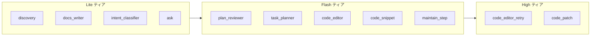

# サードパーティ AI エージェントアーキテクチャ

ScienceHUB サードパーティスタジオの Gemini 呼び出しを **三層モデル** と **エージェントレジストリ** で一元管理する設計書です。

**実装の出典**

| 領域 | ファイル |
|------|----------|
| エージェント定義・ルーティング | `functions/lib/third-party/agent-registry.ts` |
| モデル既定値・プロファイル | `functions/lib/third-party/tp-flash.ts` |
| 状態機械・チャット | `functions/lib/third-party/gemini-pipeline.ts` |
| 実装タスク・行編集 | `functions/lib/third-party/implement-tasks.ts` |
| 実装ジョブランナー | `functions/lib/third-party/implement-runner.ts` |
| メンテエージェント | `functions/lib/third-party/workspace-agent.ts` |

---

## 1. 背景と課題

### 1.1 観測されたコスト要因（コード・運用）

1. **単一 Flash モデルへの集中** — レビュー・タスク分解・行編集・リトライ・patch が同一高価モデルに寄っていた。
2. **Thinking level** — 編集プラン初回 `MEDIUM`、リトライ・patch `HIGH`（Gemini 3 系は thinking トークンが出力課金）。
3. **Standard tier のみ** — バックグラウンド実装ジョブも同期 Standard 単価。
4. **実装 1 アプリあたり** — 最大 5 タスク × 最大 3 リトライの Gemini 呼び出し。
5. **検証ループ** — 大量プロジェクト作成による累積課金。

### 1.2 設計目標

- **品質**: 実装・メンテの核心（行編集・patch）は必要時のみ High ティア。
- **コスト**: 分類・対話・Ask は Lite、計画系は Flash、リトライ/patch は High に限定。
- **運用**: 環境変数 3 つでモデルを差し替え可能。エージェント ID で呼び出し箇所を固定。

---

## 2. 文献・公式ドキュメント調査（2025–2026）

出典は各リンク。第三者ブログの単価は参考程度とし、**公式のティア・最適化方針**を主に採用した。

### 2.1 モデル階層と価格帯（概要）

| モデル例 | 公式・業界で言及される位置づけ | 本システムでの用途 |
|----------|-------------------------------|-------------------|
| `gemini-2.0-flash-lite` / `2.5-flash-lite` | 最安の Flash-Lite 帯 | Lite ティア（分類・対話） |
| `gemini-2.5-flash` | 速度・コストのバランス | Flash ティア（レビュー・計画・通常編集） |
| `gemini-3.5-flash` | 高品質・エージェント向け（高単価） | High ティア（リトライ・全文 patch）のみ |

**出典（モデル・価格の一般情報）**

- [Gemini API models](https://ai.google.dev/gemini-api/docs/models) — モデル一覧・能力
- [Gemini API optimization](https://ai.google.dev/gemini-api/docs/optimization) — Standard / Flex / Batch / Caching の比較

第三者の単価表（例: Flash-Lite $0.10/MTok 入力）は時点で変動するため、本番では Google AI Studio / Cloud の料金ページで確認すること。

### 2.2 Flex inference（バックグラウンド向け）

- **約 50% 割引**（Standard 比）、遅延は分単位・best-effort。
- **同期 API**のまま `service_tier: flex` を指定可能（Batch のようなジョブ管理不要）。
- エージェントの連鎖（タスク N の出力がタスク N+1 の入力）に向く。

**出典**

- [Flex inference | Gemini API](https://ai.google.dev/gemini-api/docs/interactions/flex-inference)
- [Introducing Flex and Priority inference (Google Blog)](https://blog.google/innovation-and-ai/technology/developers-tools/introducing-flex-and-priority-inference/)

**本システムでの適用**

- `implement-runner` 内の `task_planner` / `code_editor` / `code_snippet` は `background: true` → **FLEX**。
- ユーザーがチャット UI で待つ `discovery` / `plan_reviewer` / `maintain_step` は **STANDARD**。

### 2.3 Context caching（実装ドキュメント）

- 同一の要件・計画を各タスク編集で繰り返し送る場合、明示キャッシュで入力トークンを削減。
- `prepareImplementGeminiContext` → `createTpImplementDocsCache`（Flash ティアモデルでキャッシュ作成）。

**出典**

- [Gemini API optimization — Caching](https://ai.google.dev/gemini-api/docs/optimization)

### 2.4 エージェント設計の一般原則（文献）

| 原則 | 文献・実務での推奨 | 本システムでの対応 |
|------|-------------------|-------------------|
| ルーティング | 簡単な分類は小モデル or ルール | `classifyIntentByRules` → 一致時は LLM スキップ |
| 階層化 | Planner / Worker / Critic を分離 | Lite ヒアリング → Flash レビュー → Flash/High 実装 |
| 失敗時のみ昇格 | 初回は安いモデル、リトライで強いモデル | `code_editor` (Flash) → `code_editor_retry` (High) |
| 決定的処理 | 骨格 HTML はテンプレート | `buildProjectSkeleton`（LLM 不要） |
| バックグラウンド分離 | 非同期・低優先は安いティア | Flex on Worker |

**参考（エージェントアーキテクチャ一般）**

- Google の Flex ブログ内「agentic workflows」「background CRM updates」の記述
- 実務上の **route-then-act**（意図分類 → 専用ハンドラ）パターン

---

## 3. 三層モデル設定

### 3.1 環境変数

```bash
GEMINI_TP_LITE_MODEL=gemini-2.0-flash-lite   # または利用可能な最安 Lite
GEMINI_TP_FLASH_MODEL=gemini-2.5-flash
GEMINI_TP_HIGH_MODEL=gemini-3.5-flash
```

未設定時は `tp-flash.ts` の `DEFAULT_TP_*` が使用される。

### 3.2 ティアと課金の考え方



- **High への昇格は 2 経路のみ**: 行編集のリトライ（`attempt > 0`）、メンテの全文 `patch_html`。

---

## 4. エージェントレジストリ

### 4.1 カタログ

| エージェント ID | ティア | プロファイル | Flex 可 | 説明 |
|-----------------|--------|--------------|---------|------|
| `discovery` | lite | lite_turn | — | ヒアリング・ゲート対話 |
| `docs_writer` | lite | lite_docs | — | 要件・計画 Markdown |
| `intent_classifier` | lite | lite_intent | — | 実装後意図分類 |
| `ask` | lite | lite_ask | — | Ask Q&A（コード変更なし） |
| `plan_reviewer` | flash | flash_review | — | 計画レビュー |
| `task_planner` | flash | flash_task_plan | ✓ | 実装タスク分解 |
| `code_editor` | flash | flash_edit_plan | ✓ | 行編集プラン（初回） |
| `code_editor_retry` | high | flash_edit_plan_retry | ✓ | 行編集プラン（リトライ） |
| `code_snippet` | flash | flash_snippet | ✓ | スニペット挿入 |
| `code_patch` | high | flash_patch | ✓ | 全文 HTML patch |
| `maintain_step` | flash | flash_agent_step | — | メンテ 1 ステップ |

### 4.2 呼び出し API

```typescript
import { tpAgentGeminiOptions } from "./agent-registry";

await geminiGenerateJson(env, {
  systemInstruction: "...",
  prompt: "...",
  ...tpAgentGeminiOptions(env, "code_editor", { background: true }),
});
```

`tpAgentGeminiOptions` が返す項目: `model`, `thinkingLevel`, `serviceTier`, `usageLabel`, `maxOutputTokens`（定義時）。

### 4.3 ログ

`gemini/generate.ts` が `usageLabel` 付きで `gemini_usage` を JSON ログ出力。エージェント別のトークン消費を Cloudflare ログで追跡可能。

---

## 5. ワークフローとの対応

| フェーズ | 主なエージェント | 備考 |
|----------|------------------|------|
| discovery〜gate | `discovery`, `docs_writer` | Lite・Standard |
| flash_review | `plan_reviewer` | Flash・Standard |
| flash_implement_tasks | `task_planner`, `code_editor`, `code_editor_retry` | Worker 内・Flex |
| draft_ready / maintain | `intent_classifier`, `ask`, `maintain_step`, `code_patch` | 分類・Ask は Lite；patch は High |
| 意図分類 | ルール → `intent_classifier` | ルール一致時は LLM 0 回 |

---

## 6. コスト抑制チェックリスト

- [x] 三層モデル（Lite / Flash / High）
- [x] エージェントレジストリで呼び出し一元化
- [x] 実装 Worker で Flex tier
- [x] 意図分類のルール先行
- [x] スケルトン HTML の決定的生成
- [x] 要件・計画の Context cache（Flash モデル）
- [ ] 検証スクリプトの日次上限・プロジェクト数制限（運用）
- [ ] Spending cap / 予算アラート（Google Cloud コンソール）

### 6.1 デプロイ時

Pages シークレットに 3 モデル変数を設定後:

```bash
npm run deploy
npm run tp-pipeline:deploy
```

---

## 7. 今後の拡張

1. **動的ルーティング** — ジョブ進捗・エラー率に応じて High 昇格閾値を調整。
2. **エージェントメトリクス** — D1 に `tp_gemini_usage` 集計テーブル。
3. **Batch API** — 夜間一括再検証など、24h SLA でよい処理への移行検討。

---

## 8. 出典一覧

| トピック | URL |
|----------|-----|
| Gemini models | https://ai.google.dev/gemini-api/docs/models |
| Optimization (Flex/Batch/Cache) | https://ai.google.dev/gemini-api/docs/optimization |
| Flex inference | https://ai.google.dev/gemini-api/docs/interactions/flex-inference |
| Flex/Priority 発表 | https://blog.google/innovation-and-ai/technology/developers-tools/introducing-flex-and-priority-inference/ |
| ワークフロー全体 | `docs/third-party-ai-workflow.md` |
