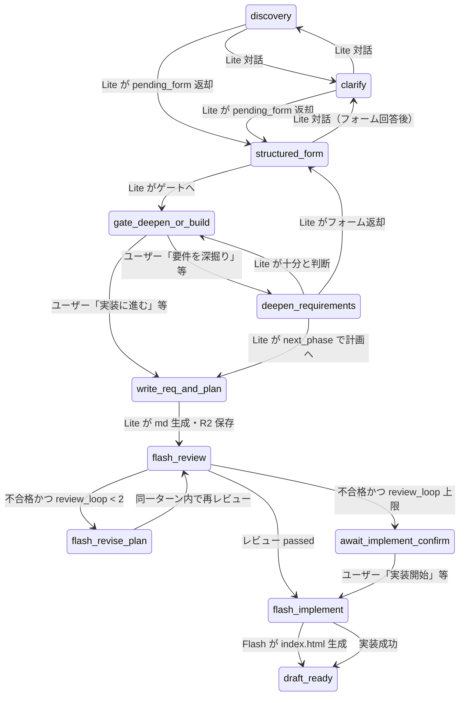

# サードパーティ AI チャットワークフロー

ScienceHUB のサードパーティスタジオで、ユーザーと AI がやり取りしながら静的 Web アプリ（単一 `index.html`）を作るまでの状態遷移と分岐の説明です。

**実装の出典（コード）**

| 領域 | ファイル |
|------|----------|
| 状態機械・1ターン処理 | `functions/lib/third-party/gemini-pipeline.ts` |
| フェーズ名・JSON スキーマ | `functions/lib/third-party/schemas.ts` |
| プロンプト | `functions/lib/third-party/prompts.ts` |
| API 入口 | `functions/api/third-party/[[path]].ts` → `postGeminiChat` |
| UI フェーズ表示 | `public/apps/third-party/js/third-party-main.js` |

`GEMINI_API_KEY` が未設定のときは Gemini パイプラインではなく `stub-chat.ts` の簡易スタブにフォールバックします（本ドキュメントのフローは Gemini 有効時）。

---

## モデル分担

| 役割 | 環境変数（任意） | コード上の既定 |
|------|------------------|----------------|
| ヒアリング・フォーム・要件/計画 Markdown | `GEMINI_TP_LITE_MODEL` | `gemini-2.5-flash-lite` |
| 計画レビュー・HTML 実装 | `GEMINI_TP_FLASH_MODEL` | `gemini-2.5-flash` |

---

## ワークフロー phase 一覧

`tp_projects.workflow_phase` に保存される値（`schemas.ts` の `TP_WORKFLOW_PHASES`）。

| phase | 意味（UI 表示例） |
|-------|-------------------|
| `discovery` | ヒアリング開始 |
| `clarify` | 意図の確認・補足質問 |
| `structured_form` | 構造化質問フォーム表示中 |
| `gate_deepen_or_build` | 「深掘り」か「実装に進む」かの選択 |
| `deepen_requirements` | 要件の追加ヒアリング |
| `write_req_and_plan` | 要件定義・実装計画の生成（内部遷移） |
| `flash_review` | Flash による計画レビュー（内部遷移） |
| `flash_revise_plan` | レビュー不合格後の計画差し替え済み・再レビュー待ち |
| `flash_implement` | HTML 実装中（内部遷移） |
| `await_implement_confirm` | レビュー懸念あり・ユーザーの実装開始待ち |
| `draft_ready` | 実装完了・プレビュー可能 |

新規プロジェクト作成時は `discovery`。初回アシスタントメッセージのみ DB に入り、その後はユーザー送信で進みます。

---

## 全体の流れ（状態遷移）



**注意:** `write_req_and_plan` / `flash_review` / `flash_implement` は、ユーザーがメッセージを送った **1 リクエストの中で** 連続して処理されることがあります（例: 「実装に進む」→ そのターンでドキュメント生成 → レビュー → 合格なら実装まで進む）。

---

## Lite フェーズ（対話・フォーム）

**対象 phase:** `discovery`, `clarify`, `structured_form`, `gate_deepen_or_build`, `deepen_requirements`

**処理:** `runLiteTurn`（`LITE_TURN_SCHEMA` の JSON）

- 入力: `context_summary`、直近チャット 6 件、ユーザー今回入力
- 出力: `assistant_message`, `context_summary` 更新, `next_phase`, 任意で `pending_form`

**分岐の要点**

1. Lite が `pending_form`（質問リスト）を返すと、phase は **`structured_form` に固定**し、`pending_form_json` を DB に保存する。
2. ユーザーは UI のフォームで回答 → API は `form_responses` を受け取り、本文を `【フォーム回答】...` 形式の **1 ユーザーメッセージ** に変換してから同じパイプラインへ渡す。
3. Lite が `next_phase` を `gate_deepen_or_build` にすると、フォームはクリアされ、UI に「要件を深掘り」「実装に進む」ボタンが出る。
4. Lite が `next_phase` を `write_req_and_plan` にした場合、同ターン内で `writeDocsPhase` が走る（後述）。

一般質問（「どう作ればいい？」など）も Lite が `assistant_message` で答える。

---

## ゲート（ユーザー明示の分岐）

phase が `gate_deepen_or_build` のとき、チャットの文言または UI ボタンでサーバー側トリガーが分岐する（`wantsDeepenRequirements` / `wantsGateBuildDocs`）。

| ユーザー意図 | 例 | 遷移 |
|--------------|-----|------|
| 要件を深掘り | 「要件を深掘り」「深掘り」 | `deepen_requirements` + 固定アシスタント文 |
| 実装計画へ | 「実装に進む」「実装して」「作って」、ゲート時の `implement_now` | `write_req_and_plan` → `writeDocsPhase` |

**重要:** 「実装に進む」は **HTML 実装ではなく** 要件定義書・実装計画書の生成である。HTML 実装は別トリガー（下記「実装開始」）。

ゲート中の「実装して」は **計画作成** として扱う。`await_implement_confirm` 中の「実装して」は **実装開始** として扱う（意図が異なる）。

---

## ドキュメント生成（Lite）

**phase:** `write_req_and_plan`（多くはゲートから自動遷移）

**処理:** `writeDocsPhase` → `runLiteDocs`（`LITE_DOCS_SCHEMA`）

R2 `third-party/{dir_name}/` に保存:

- `requirements.md`
- `implementation-plan.md`

完了後 phase は **`flash_review`**。アシスタントには `assistant_message`（生成完了の説明）が追加される。

---

## 計画レビュー（Flash）

**phase:** `flash_review`

**処理:** `flashReviewPhase` → `runFlashReview`（`PLAN_REVIEW_SCHEMA`）

- R2 に `review-last.json` を保存
- 不合格かつ `revised_plan_markdown` がある場合、`implementation-plan.md` を上書き

| 結果 | 条件 | 次の phase |
|------|------|------------|
| 合格 | `passed === true` | `flash_implement`（同一ターンで実装へ進むことあり） |
| 不合格・ループ内 | `review_loop_count + 1 < 2`（`MAX_REVIEW_LOOPS`） | `flash_revise_plan` + 「実装開始」案内 |
| 不合格・ループ上限 | 上記以外 | `await_implement_confirm` |

`flash_revise_plan` に入った後、**次のチャットターンの先頭**で phase が `flash_review` に戻し、再レビューが走る（別の「改訂専用」API はない。改訂本文は前回レビューで計画に反映済み）。

---

## HTML 実装（Flash）

**phase:** `flash_implement`

**処理:** `flashImplementPhase` → `runFlashImplement`

- 入力: R2 の要件・計画 Markdown（チャット全履歴は渡さない）
- 出力: `index.html` を R2 に保存、phase **`draft_ready`**
- 試行回数 `implement_attempts` を加算（上限 `MAX_IMPLEMENT_ATTEMPTS` = 3）

**実装開始トリガー**（`implementStartTrigger`）:

- 常に: 文言が **`実装開始`**
- `awaiting_implement_confirm === 1` のとき: `implement_now`、`実装して`、単独の `実装`

レビュー **合格** 時は `flash_review` の直後に自動で `flash_implement` へ進む（ユーザー確認なし）。

---

## 1 ターン内の処理順序（実装の実行順）

`runTpGeminiChat` は 1 回の POST で次の順に評価する。これが「同じ送信で複数フェーズが進む」理由になる。

1. `form_responses` → ユーザーテキストへ変換
2. **実装開始**トリガーなら `flash_implement`
3. **深掘り** or **ゲートで計画作成**
4. phase が `write_req_and_plan` なら `writeDocsPhase`
5. phase が `flash_review` なら `flashReviewPhase`（合格なら続けて実装）
6. phase が `flash_revise_plan` なら `flash_review` に戻して再レビュー
7. phase が `flash_implement` かつ未実装なら `flashImplementPhase`
8. Lite 対象 phase かつゲート/深掘りトリガーでない場合 → `runLiteTurn`

---

## 制限・その他

| 項目 | 値 | 実装 |
|------|-----|------|
| 1 ユーザー 1 日あたりのチャットターン | 30 | `assertDailyTurnLimit`（実装開始トリガー時はユーザーメッセージ未挿入のためカウントされない場合あり） |
| レビューループ | 最大 2 回 | `review_loop_count`, `MAX_REVIEW_LOOPS` |
| 実装試行 | 最大 3 回 | `implement_attempts`, `MAX_IMPLEMENT_ATTEMPTS` |

**再送信・編集:** `rewind_to_message_id` 付き POST で、指定ユーザー発言以降のメッセージを削除し、`workflow_phase` を `discovery` に戻してから再送する（`third-party.ts` の `rewindChatFromUserMessage`）。フォーム回答行（`【フォーム回答】` 始まり）は再送信不可。

**公開:** `draft_ready` かつプレースホルダー以外の HTML が必要（`publishTpProject`）。

---

## API（チャット）

```
POST /api/third-party/projects/:id/chat
```

| body フィールド | 用途 |
|-----------------|------|
| `message` | 通常のチャット文 |
| `form_responses` | 構造化フォーム回答（`pending_form` があるとき） |
| `rewind_to_message_id` | 再送信・編集時、そのユーザーメッセージ ID 以降を巻き戻し |

レスポンス: `messages`, `phase`, `pending_form`, `review_summary`, `htmlUpdated`, `dir_name`

---

## フロント UI との対応

| UI | phase / 条件 |
|----|----------------|
| サジェスト（ランディングページ等） | `discovery` / `clarify` |
| 動的フォーム | `pending_form` あり（多くは `structured_form`） |
| 「要件を深掘り」「実装に進む」 | `gate_deepen_or_build` |
| 「実装開始」 | `await_implement_confirm` |
| フェーズバッジ | `PHASE_LABELS` in `third-party-main.js` |

---

## 更新履歴

- 2026-07-28: 初版（`gemini-pipeline.ts` 現行実装に基づく）
